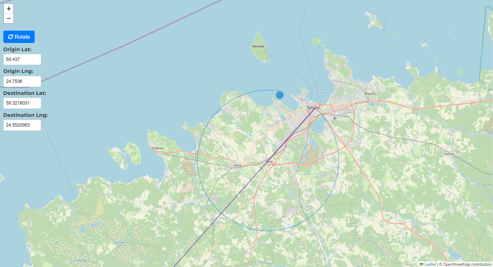
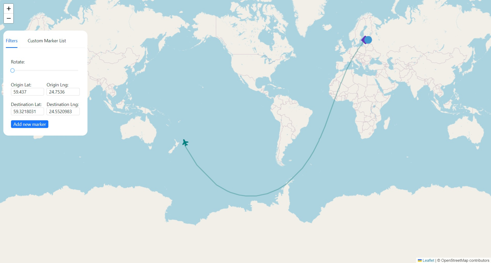

# Flying Objects Simulation with ReactJS

## Front-end Developer Test Task

This application is a simulation of flying objects using ReactJS. It includes a map layer, navigation controls, and an interaction layer for adding and controlling different types of objects: SQUARE, CIRCLE, and TRIANGLE.

### Features

1. **Map Layer:**
   - The application features an interactive map layer to provide a visual representation of object movements.

2. **Map Navigation Controls:**
   - Zooming, moving, and rotating controls are implemented to manipulate the base map for a better view.

3. **Interaction Layer:**
   - **Add SQUARE Object:**
      - A SQUARE object starts in the territory of Estonia.
      - It moves with a random speed between 50 and 80 km/h.
      - It travels on a straight path on a Great Circle and returns to the starting position.
      
   - **Add CIRCLE Object:**
      - A CIRCLE object starts in the territory of Estonia.
      - It moves with a random speed between 110 and 300 km/h.
      - It travels on a circular path with a radius of 10000 – 30000m and disappears after returning to the origin point.
      
   - **Add TRIANGLE Object:**
      - A TRIANGLE object starts in the territory of Estonia.
      - It moves with a random speed between 1700 and 2200 km/h.
      - Its destination is a point randomly chosen anywhere on Earth.
      - It travels on the shortest path from origin to destination point, considering the Earth's curvature.
      - The element has a lifespan of one hour or ends its life upon arrival at the destination.

4. **Object Control Layer:**
   - Capabilities to display and hide any of the object types: SQUARE, CIRCLE, and TRIANGLE.

5. **Clickable Objects:**
   - Each individual object of type SQUARE, CIRCLE, and TRIANGLE is clickable.

6. **Object Activation Display:**
   - Upon activation, display the following information for the clicked object:
      - Speed
      - Current location
      - Time to expire
      - Current trajectory
      - A tail of traveled trajectory in the last 60 seconds

### Screenshots






## Usage

```bash

# Navigate to the project directory
cd simulation-of-objects

# Install dependencies
npm install

# Run the application
npm start
```

## Contact

Thank you for checking out! If you have any questions or feedback, feel free to reach out.
- Project Maintainer: [shayanshaikh996@gmail.com](mailto:shayanshaikh996@gmail.com)
